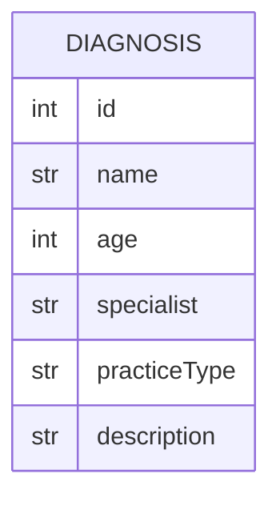

# 🩺 Diagnose Me 🩺

- **Contributors:** Isaac Asher
- [**Backend Source Code**](https://github.com/isaacasher97/diagnoseMe_capstone_backend)
- [**Frontend Source Code**](https://github.com/isaacasher97/diagnoseMe_capstone_frontend)
- [**Deployed Backend Site**](https://diagnose-me-backend.onrender.com/diagnosis/)
- [**Deployed Frontend Site**](https://diagnose-me-capstone-frontend.vercel.app/)
- [**Jira Board**]()

## 🧑‍💻 Technologies 🧑‍💻


<br/>


## 🗒️ Description 🗒️

Diagnose Me takes the struggle out of finding the right diagnosis when you're not feeling well 🤒  

Users can access a page to search for a possible diagnosis by choosing their symptoms in a dropdown menu which uses APImedic to get the data for the users diagnosis

Through a separate form, users can add every diagnosis that they received from APImedic. 

Each post will be contain the information from the daignosis users recevied with an extra input field for the decription of the diagnosis. This allows users to track any past, current, or future posts.

Users can also access a database of doctors for the type of care they need by using their geolocation to find the nearest doctors using ZocDoc Api (Not Yet Confirmed)

Whether you're interested in keeping track of your medical history, doctor visits, or simply want to check your symptoms or local medical professionals. Dianose Me is your go-to application for keeping your medical history in check.

## 🔍 Main Features 🔍
Add Your diagnosis to keep record of any past, current, or future symptoms

- Search Capability: An intuitive search system that allows users to input their symptoms information, age, and gender in order to recieve their diagnosis from APImedic 

- Medical Professional Locator: Users Will have access to search through a database of medical professionals allowing them to find the doctors that they need in any category and zip code.

## 🖍️ Mock UP of UI 🖍️

***Home Page***


***Create Diagnosis Page***


***Single Diagnosis Page***


## 🩺 Endpoints 🩺


## 🩺 Schemas 🩺


## ERD (ENTITY RELATIONSHIP DIAGRAM) 🩺


## Project setup
```
npm install
npm run serve
```
